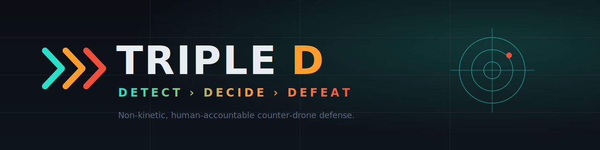

<p align="center">
  
</p>

<p align="center">
  <code>DETECT → DECIDE → DEFEAT</code> &nbsp;·&nbsp; <code>DISTRACT · DISABLE · DEFEND</code><br>
  <em>The safe action is automatic. The hard one asks you.</em>
</p>

---

# Triple D

Layered, non-kinetic defense against RF-silent (fiber-optic) suicide drones.
**Pipeline:** `DETECT → DECIDE → DEFEAT`. **Heads:** `DISTRACT · DISABLE · DEFEND`.

This is one system across two brains — a thin C firmware on the car and a
Python brain on the Arduino Uno Q. **One repo, two folders.**

```
triple-d/
├── uno_r3/triple_d_car/triple_d_car.ino   # flash once; runs forever
└── uno_q/                                  # python main.py; the brain
    ├── main.py        # state machine (IDLE→DECIDING→AUTHORIZING→DEFEATING→COOLDOWN)
    ├── config.py      # ALL tunables, mock flags, the autonomy dial
    ├── comms.py       # serial link + scripted mock telemetry
    ├── detect.py      # DETECT  (acoustic, from the car's mic features)
    ├── decide.py      # DECIDE  (vision + closing-behavior + fusion)
    ├── operator.py    # human-in-the-loop authorization
    ├── defeat.py      # DEFEAT  (sends effect commands to the car)
    └── models/        # drop trained .tflite here
```

## Architecture
```
[UNO R3 on car]  --- USB serial --->  [Uno Q : Python/Linux]
  mic features (amp,pitch)             DETECT  acoustic gate
  ultrasonic distance                  DECIDE  webcam ML + fusion
  drives motors                        OPERATOR human authorizes
  fires LED / IR / relay effects       DEFEAT  picks heads, sends commands
```
The car never decides anything. All intelligence is Python on the Uno Q.

## Serial protocol (115200 baud, newline-terminated ASCII)
```
UP   (car -> Uno Q):  TEL,AMP:512,PITCH:2200,DIST:84,LINE:0
DOWN (Uno Q -> car):  CMD,DISTRACT_ON   (also: DISTRACT_OFF, DAZZLE_ON/OFF,
                                          DRIVE_F/B/L/R/S, ALL_OFF, IDLE)
```
Human-readable on purpose: open a serial monitor and you can read the whole
conversation while debugging.

## Run it RIGHT NOW (no hardware)
```bash
cd uno_q
pip install pyserial
python main.py
```
`config.MOCK_SERIAL = True` synthesizes a scripted threat ~3s in. You'll watch
DETECT fire, a HOSTILE verdict appear, an authorization prompt (press `y`), and
the DEFEAT commands print. This is your skeleton working end-to-end.

## Bring-up plan (flip one thing on at a time)
1. **Mock pipeline** — as above. Prove the state machine + authorization.
2. **Serial round-trip** — flash `triple_d_car.ino`, set `MOCK_SERIAL = False`,
   set `SERIAL_PORT`. Confirm real `TEL,...` lines arrive and `CMD,...` lands.
3. **Acoustic** — point your drone-noise source at the mic; tune `AMP_FLOOR`
   and `PITCH_BAND` until DETECT is reliable.
4. **Vision** — train the Teachable-Machine model (see `models/README.md`),
   set `MOCK_VISION = False`.
5. **Effects** — wire decoy LEDs / IR array / relay-heater to the car pins and
   verify each `CMD` actuates.
6. **Tune fusion + autonomy level**, then rehearse the demo.

## Wiring notes (verify against YOUR hardware)
- Pins in the `.ino` are **placeholders** — match them to your wiring or, if
  using the ELEGOO V4 shield, replace the `drive*()` bodies with ELEGOO's
  motor library calls.
- The Uno Q has a single USB-C port — power + webcam go through the multiport
  adapter; power the car-mounted Uno Q from a USB-C battery bank.
- Acoustic features are extracted on the UNO via amplitude + zero-crossing
  pitch (no library). `analogRead` limits usable pitch to a couple kHz — enough
  to separate prop-whine from ambient. Upgrade to ArduinoFFT/Goertzel for a
  sharper spectrum.

## Degrees of autonomy (the dial in `config.AUTONOMY_LEVEL`)
| L | Behavior | Who fires |
|---|----------|-----------|
| 0 | Teleop | human does everything |
| 1 | Single-action assist | human triggers each effect |
| 2 | Detect + recommend | **human gates ALL actions** (default / target demo) |
| 3 | Human-on-the-loop | system acts, human can veto in a window |
| 4 | Bounded autonomy | auto-DISTRACT only (harmless); gate DISABLE/DEFEND |
| 5 | Multi-agent | swarm hands off targets over the mesh |

Design principle: **the safe action can be automated; the harmful one always
asks a human first.** That split (L4) is the responsible-autonomy story.

## Honesty notes (don't oversell to judges)
- **DEFEND is tracking-only.** Cutting a hair-thin moving fiber is out of scope
  for this hardware; the demo is precision lock-and-track. No "cut" command
  exists by design.
- **DISABLE** = defeat the seeker (IR dazzle), not "disarm the bomb."
- **One mic = detection, not bearing.** Direction-finding needs multiple nodes.
- Always rehearse with **L0 teleop** available as a fallback.
```
```
